# addon-confirmate-evidence

[](LICENSE)
[](https://opennebula.io)
[](https://emerald-he.eu)

**Evidence Collection Gateway** for [OpenNebula](https://opennebula.io)
→ [Confirmate](https://github.com/confirmate/confirmate) (Fraunhofer
AISEC), enabling continuous EUCS compliance certification. Part of the
**EMERALD** project (EU Horizon Europe, grant 101120688), Pilot 4
(hybrid cloud-edge for the financial sector).

When something happens in OpenNebula — a VM starts, a NIC is attached, an
image is uploaded, a network is created — this addon automatically maps
the affected resource to Confirmate's ontology and POSTs it to Confirmate's
Evidence Store. Confirmate then evaluates compliance metrics (EUCS, CIS,
CSA CCM) against the evidence and produces verdicts that surface in the
EMERALD UI.

---

## How it works

```mermaid
flowchart LR
    subgraph ONE["🟢 OpenNebula Front-End"]
        direction TB
        ACT["onevm create<br/>onevm nic-attach<br/>oneimage create<br/>onevnet create"]
        HOOK["hook-confirmate-* scripts<br/>fire automatically"]
        LIB["OntologyMapper<br/>ConfirmateClient<br/>TokenManager"]
        ACT -->|"state change<br/>or API call"| HOOK
        HOOK --> LIB
    end

    subgraph CF["🔵 Confirmate"]
        direction TB
        EV["Evidence Store"]
        AS["Assessment Engine<br/>(Rego policies)"]
        OR["Orchestrator<br/>+ Verdict store"]
        EV --> AS --> OR
    end

    UI["⬜ EMERALD UI<br/>compliance dashboard"]

    LIB -->|"POST /v1/evidence_store/evidence<br/>OAuth2 Bearer JWT"| EV
    OR -->|"GET /v1/orchestrator/assessment_results"| UI

    style ONE fill:#0e3a1a,stroke:#0a6,color:#fff
    style CF fill:#0a2540,stroke:#06f,color:#fff
    style UI fill:#222,stroke:#ccc,color:#fff
```



In one sentence: **a few small Ruby scripts attached to OpenNebula's
hook subsystem turn cloud lifecycle events into Confirmate evidence
over a plain HTTP/JSON POST**.

---

## Quick start

You'll need ~15 minutes. **Sections 1 → 4 are mandatory**; section 0 is
optional (skip if you already have a Confirmate URL).

### 0. (Optional) Bring up a local Confirmate

Skip if you already have a Confirmate URL and credentials.

```bash
# Install Go 1.26+ (any Linux host the OpenNebula Front-End can reach)
curl -fsSL -O https://go.dev/dl/go1.26.3.linux-amd64.tar.gz
sudo rm -rf /usr/local/go && sudo tar -C /usr/local -xzf go1.26.3.linux-amd64.tar.gz
export PATH=$PATH:/usr/local/go/bin

# Clone, build, run
git clone --recurse-submodules https://github.com/confirmate/confirmate
cd confirmate/core
go build -o bin/confirmate ./cmd/confirmate
tmux new-session -d -s confirmate -c "$(pwd)" \
  "./bin/confirmate --auth-enabled --oauth2-embedded \
                    --oauth2-key-save-on-create \
                    --db-in-memory \
                    --create-default-target-of-evaluation \
                    --api-port 8080 2>&1 | tee /var/log/confirmate.log"

# Verify it's listening
curl -sS -o /dev/null -w "%{http_code}\n" http://localhost:8080/v1/auth/certs   # → 200
```

For this test instance:
- Confirmate URL: `http://<host>:8080`
- Client ID / secret: `confirmate` / `confirmate`
- Default Target of Evaluation UUID: `00000000-0000-0000-0000-000000000000`

> In-memory test instance: data is lost on restart. For production use a Postgres backend.

### 1. Install the addon (on the OpenNebula Front-End)

```bash
cd /root  # or anywhere writable by root
git clone https://github.com/pablodelarco/addon-confirmate-evidence
cd addon-confirmate-evidence
sudo ./install.sh
```

The installer places library files under `/var/lib/one/remotes/hooks/`,
copies the default config to `/etc/one/confirmate-evidence.conf`, and
registers the 7 hooks with `onehook create`.

✅ **Success looks like:** the installer ends with `Installation
complete!` and `ls /var/lib/one/remotes/hooks/confirmate_*.rb` shows
4 files.

### 2. Configure

Edit `/etc/one/confirmate-evidence.conf` — only three fields really matter:

```yaml
confirmate:
  endpoint: "http://CONFIRMATE-HOST:8080"     # 1) your Confirmate URL
  auth:
    enabled: true                              # 2) true for production
    token_url: "http://CONFIRMATE-HOST:8080/v1/auth/token"
    client_id: "confirmate"                    # 3) OAuth client id/secret
    client_secret: "confirmate"                #    EMERALD gave you

evidence:
  tool_id: "opennebula-addon-confirmate-evidence"
  target_of_evaluation_id: "PASTE-TOE-UUID-HERE"   # from the EMERALD UI
  default_region: "eu-south-1"

logging:
  level: "info"
  file: "/var/log/one/confirmate-evidence.log"
```

After editing:

```bash
sudo chown oneadmin:oneadmin /etc/one/confirmate-evidence.conf
sudo chmod 640 /etc/one/confirmate-evidence.conf
```

### 3. Verify the hooks are registered

```bash
sudo -u oneadmin onehook list
```

You should see seven `hook-confirmate-*` entries. If they're missing,
register them manually:

```bash
sudo cp /root/addon-confirmate-evidence/templates/*.tmpl /tmp/
sudo chmod 644 /tmp/hook-*.tmpl
sudo -u oneadmin sh -c 'for t in /tmp/hook-*.tmpl; do onehook create "$t"; done'
```

### 4. First end-to-end test

The fastest sanity check — create a throwaway VNet, watch the
`hook-confirmate-net-create` hook fire and ship evidence to Confirmate:

```bash
sudo truncate -s0 /var/log/one/confirmate-evidence.log

cat <<'EOF' | sudo tee /tmp/test-vnet.tmpl > /dev/null
NAME   = "confirmate-test"
VN_MAD = "dummy"
BRIDGE = "br-test"
AR = [ TYPE = "IP4", IP = "192.0.2.0", SIZE = "4" ]
EOF
sudo chmod 644 /tmp/test-vnet.tmpl

VNET_ID=$(sudo -u oneadmin onevnet create /tmp/test-vnet.tmpl | grep -oP 'ID: \K[0-9]+')
sleep 3
sudo tail -20 /var/log/one/confirmate-evidence.log

sudo -u oneadmin onevnet delete $VNET_ID   # cleanup
```

✅ **Success looks like:** an `Evidence ... stored successfully (HTTP 200)`
line in the addon log. That's the moment your evidence reached Confirmate.

That's it — installed and operational. From here on the addon reacts
to OpenNebula events automatically; you don't run anything by hand.

---

## What fires automatically

Once installed, the addon reacts to OpenNebula events without further
intervention. Existing VMs are **not** scanned retroactively — hooks fire
on *future* state transitions only.

| OpenNebula action | Hook | Evidence sent |
|---|---|---|
| VM enters RUNNING | `hook-confirmate-vm-running` | VirtualMachine + each NetworkInterface |
| VM enters POWEROFF | `hook-confirmate-vm-poweroff` | updated VirtualMachine |
| VM is terminated | `hook-confirmate-vm-done` | final VirtualMachine state |
| `onevm nic-attach` | (covered by vm-running re-firing) | updated VirtualMachine + NICs |
| `onevm nic-detach` | (covered by vm-running re-firing) | updated VirtualMachine + NICs |
| Image reaches READY | `hook-confirmate-image-ready` | VMImage |
| `onevnet create` | `hook-confirmate-net-create` | VirtualNetwork |

To watch evidence flow live:

```bash
sudo tail -f /var/log/one/confirmate-evidence.log
```

---

## See compliance verdicts

Once Confirmate has received some evidence, it runs Rego policies
against it and produces verdicts:

```bash
# Get a token (the same credentials as in your addon config)
ACCESS=$(curl -sS -u <client-id>:<client-secret> \
  -d 'grant_type=client_credentials' \
  http://CONFIRMATE-HOST:8080/v1/auth/token \
  | sed -n 's/.*"access_token":"\([^"]*\)".*/\1/p')

# Query verdicts
curl -sS -H "Authorization: Bearer $ACCESS" \
  http://CONFIRMATE-HOST:8080/v1/orchestrator/assessment_results \
  | python3 -m json.tool
```

Each result entry links back to the originating evidence by ID:

```json
{
  "metricId":  "...",
  "compliant": true,
  "evidenceId": "...",
  "resourceId": "one-vm-42",
  "resourceTypes": ["VirtualMachine", "Compute", ...],
  "complianceComment": "The result of the metric shows that the evidence is compliant to the target value.",
  "targetOfEvaluationId": "..."
}
```

> **If `assessment_results` returns `{}`** despite evidence being
> visible in the addon log: that endpoint is *user-permission-filtered
> by ToE*. Service-account credentials (which the addon uses) typically
> don't have read permission on the ToE — so they see an empty list
> even when verdicts exist. Query with the same account the EMERALD UI
> uses, or with an admin user that has read rights on the ToE. **This
> is not a bug** — collectors push, the UI reads.

---

## Configuration reference

| Parameter | Description | Default |
|---|---|---|
| `confirmate.endpoint` | Confirmate orchestrator REST URL | `http://localhost:8080` |
| `confirmate.auth.enabled` | Send `Authorization: Bearer …` | `false` |
| `confirmate.auth.token_url` | OAuth2 token endpoint | `http://localhost:8080/v1/auth/token` |
| `confirmate.auth.client_id` | OAuth2 client ID | `confirmate` |
| `confirmate.auth.client_secret` | OAuth2 client secret | `confirmate` |
| `confirmate.auth.static_token` | Pre-issued bearer token (bypass OAuth) | _(empty)_ |
| `evidence.tool_id` | Tool identifier in every evidence | `opennebula-addon-confirmate-evidence` |
| `evidence.target_of_evaluation_id` | ToE UUID created in EMERALD UI | _(placeholder)_ |
| `evidence.default_region` | Geo-location label | `eu-south-1` |
| `logging.level` | Log verbosity: debug, info, warn, error | `info` |
| `logging.file` | Log file path | `/var/log/one/confirmate-evidence.log` |

---

## Resource mapping (`confirmate.ontology.v1`)

### OpenNebula VM → VirtualMachine

| ONE XML field | Ontology field | Notes |
|---|---|---|
| `<ID>` | `id` | `"one-vm-{id}"` |
| `<NAME>` | `name` | |
| `<STIME>` | `creationTime` | Unix epoch → RFC 3339 |
| `<NIC>` (all) | `networkInterfaceIds` | IDs only; full NIC data is its own evidence |
| `<DISK>` (all) | `blockStorageIds` | IDs only |
| `<NIC><EXTERNAL>` or non-RFC1918 IP | `internetAccessibleEndpoint` | bool |
| `<MONITORING>` | `bootLogging.enabled`, `osLogging.enabled` | heuristic |
| — | `automaticUpdates.enabled` | always `false` (no ONE source) |
| `<DISK><ENCRYPT>` / `<CIPHER>` | _(in `raw` XML only)_ | Confirmate's ontology no longer carries at-rest-encryption on the VM level |

### OpenNebula NIC → NetworkInterface

| ONE XML field | Ontology field |
|---|---|
| `<NIC_ID>` | `id` (`"one-nic-{vm_id}-{nic_id}"`) |
| `<NETWORK>` | `name` |
| `<EXTERNAL>` or non-RFC1918 IP | `internetAccessibleEndpoint` |
| `<IP>` | `labels.ip` |
| `<NETWORK>` | `labels.network` |
| `<SECURITY_GROUPS>` | `labels.securityGroupIds` |

`confirmate.ontology.v1.NetworkInterface` does not have first-class
fields for IP address or security-group membership; both are carried
in `labels` (a `map<string,string>`) so they remain queryable by
Confirmate policies.

### OpenNebula Image → VMImage

| ONE XML field | Ontology field |
|---|---|
| `<ID>` | `id` (`"one-image-{id}"`) |
| `<NAME>` | `name` |
| `<REGTIME>` | `creationTime` |
| `<PERMISSIONS><OTHER_U>` | `publicAccess` |

---

## EUCS / CIS controls covered

| Control | Description | Evidence source |
|---|---|---|
| CIS 4.3 | VM Disk Encryption with CSEK | `DISK/ENCRYPT` + `DISK/CIPHER` (raw) |
| CIS 4.4 | No Public IP on Compute Instances | `NIC/EXTERNAL`, IP-range check → `internetAccessibleEndpoint` |
| CIS 8.3 | Storage Not Publicly Accessible | `IMAGE/PERMISSIONS/OTHER_U` |
| CIS 8.5 | Cloud Asset Inventory Enabled | Continuous evidence collection |
| CIS 8.6 | Cloud Audit Logging Configured | `MONITORING` presence |
| CIS 9.2 | SSH Access Restricted | `NIC/SECURITY_GROUPS` |
| CIS 9.3 | RDP Access Restricted | `NIC/SECURITY_GROUPS` |

---

## Troubleshooting

Each entry below is a real error message from real deployment
experience, with the actual cause and fix.

### `command create: argument 0 must be one of file`

You ran `onehook create somefile.tmpl` and the template lives somewhere
`oneadmin` can't read — typically `/root/...` (mode 700). The error
message is misleading; the real cause is `Permission denied` on the
file.

**Fix.** Stage templates in a world-readable location first:

```bash
sudo cp /root/addon-confirmate-evidence/templates/*.tmpl /tmp/
sudo chmod 644 /tmp/hook-*.tmpl
sudo -u oneadmin sh -c 'for t in /tmp/hook-*.tmpl; do onehook create "$t"; done'
```

### `HTTP 401 Unauthorized` in the addon log

The OAuth token request succeeded but the bearer token was rejected on
`POST /v1/evidence_store/evidence`. Almost always:

- `confirmate.auth.client_id` or `client_secret` in the config is
  wrong, or
- Confirmate was started without `--auth-enabled` but the addon has
  `auth.enabled: true` (or vice versa).

**Fix.** Reconcile the two ends.

### `HTTP 400` with a field validation message

The JSON body Confirmate sees is rejected by its validator. Most
commonly `target_of_evaluation_id` is not a valid UUID or still has
the placeholder value against a production Confirmate that expects a
real ToE.

**Fix.** Paste the real ToE UUID from the EMERALD UI into
`evidence.target_of_evaluation_id`.

### Hook fires but no `Evidence stored successfully` line follows

The addon connected to Confirmate but the POST failed silently. Test
reachability from the OpenNebula Front-End:

```bash
curl -sS -o /dev/null -w "%{http_code}\n" \
  http://CONFIRMATE-HOST:8080/v1/auth/certs
```

If that's not `200`, it's a network / DNS / firewall issue. If it IS
`200`, set `logging.level: debug` in the config, fire one more event,
and the log will show the exact HTTP response from Confirmate.

### Confirmate log spam: `Stream restarted ... err="unknown: write envelope: EOF"`

A long-running Confirmate process degrades its internal bidi streams.
Evidence ingestion still works but assessment verdicts may stop
flowing through. **Fix.** Restart Confirmate:

```bash
tmux kill-session -t confirmate
# then re-run the tmux new-session command from Quick Start §0
```

For persistent production deployments, use a Postgres backend so data
survives the restart.

### `assessment_results` returns `{}` even though evidence is in the log

That endpoint filters by user permission on the ToE. Service-account
credentials (which the addon uses) typically don't have read
permission on the ToE — so they see `{}` even when verdicts exist.
Query with the EMERALD UI's account or with an admin user.

### `nic-attach` / `nic-detach` events don't show dedicated NIC hook activity

On OpenNebula 7.2 the dedicated NIC API hooks don't fire (the hook
validator and the API dispatcher use different method names for the
same operation). **You don't lose data**: the VM transitions back to
RUNNING after the hot-plug and the VM state hook re-fires, re-emitting
VM + NIC evidence with the new NIC list. Check
`/var/log/one/confirmate-evidence.log` after a `nic-attach` — you'll
see the re-emission within a few seconds.

---

## Day-to-day operation

```bash
# Is the addon healthy?
sudo tail -20 /var/log/one/confirmate-evidence.log

# Which hooks fired recently, and did they succeed?
sudo -u oneadmin onehook log --since $(date -d '1 hour ago' +%m/%d) | head -30

# Is Confirmate reachable from the OpenNebula Front-End?
curl -sS -o /dev/null -w "%{http_code}\n" http://CONFIRMATE-HOST:8080/v1/auth/certs  # → 200
```

---

## Tests

```bash
ruby tests/test_ontology_mapper.rb   # 22 unit tests for the XML → JSON mapping
ruby tests/test_token_manager.rb     #  6 unit tests for the OAuth2 flow
ruby tests/smoke.rb                  # end-to-end POST to a live Confirmate (skips cleanly if none reachable)
```

The smoke test honors these env vars:

```
CONFIRMATE_URL          (default http://localhost:8080)
TOE_ID                  (default 00000000-0000-0000-0000-000000000000)
CONFIRMATE_AUTH         "on" / "true" / "1" / "yes"  → use bearer auth
CONFIRMATE_CLIENT_ID    (default "confirmate")
CONFIRMATE_CLIENT_SECRET (default "confirmate")
```

---

## Uninstall

```bash
sudo ./uninstall.sh
```

Removes the 7 hooks, the library and hook scripts, and asks before
deleting `/etc/one/confirmate-evidence.conf`. Logs at
`/var/log/one/confirmate-evidence.log` are not deleted.

---

## Project layout

```
addon-confirmate-evidence/
├── etc/
│   └── confirmate-evidence.conf      # Configuration (YAML)
├── lib/
│   ├── confirmate_client.rb          # HTTP client for Evidence Store
│   ├── ontology_mapper.rb            # ONE XML → confirmate.ontology.v1
│   └── token_manager.rb              # OAuth2 client_credentials
├── hooks/
│   ├── confirmate_vm_evidence.rb     # VM state change hook
│   ├── confirmate_nic_evidence.rb    # NIC attach/detach hook
│   ├── confirmate_image_evidence.rb  # Image state hook
│   └── confirmate_net_evidence.rb    # Network creation hook
├── templates/                        # OpenNebula hook registration templates
├── tests/                            # Unit tests + smoke test
├── examples/                         # Sample evidence JSON payloads
└── install.sh / uninstall.sh         # Lifecycle scripts
```

The `demo/` directory contains the legacy Clouditor-era Docker setup
and is not maintained for Confirmate. Use the Quick Start above
against an upstream Confirmate checkout instead.

---

## Acknowledgments


This project has received funding from the European Union's Horizon
Europe research and innovation programme under grant agreement No.
**101120688** ([EMERALD](https://emerald-he.eu)).

**Partners:**
- [Fraunhofer AISEC](https://www.aisec.fraunhofer.de/) — Confirmate development and EUCS expertise
- [OpenNebula Systems](https://opennebula.io) — Cloud management platform and addon development
- [CaixaBank](https://www.caixabank.com) — Pilot 4 validation (financial sector)

## License

Licensed under the Apache License, Version 2.0. See [LICENSE](LICENSE) for details.
